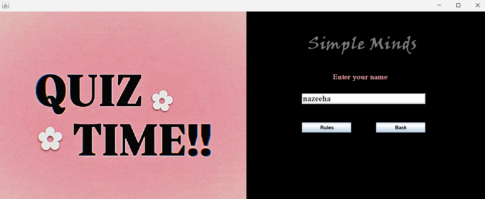
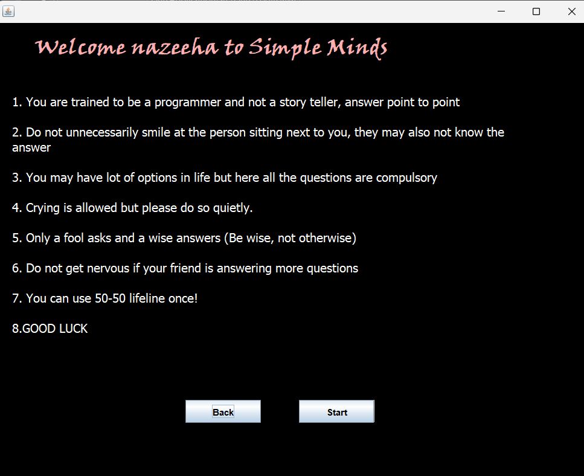
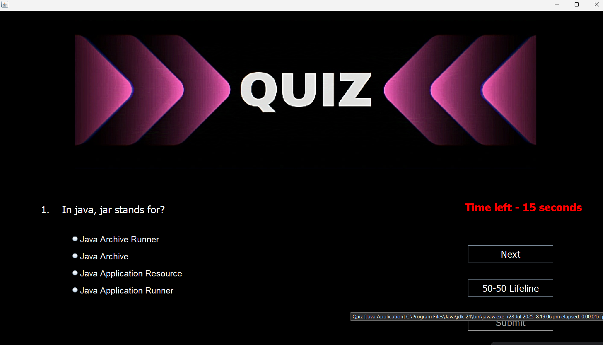
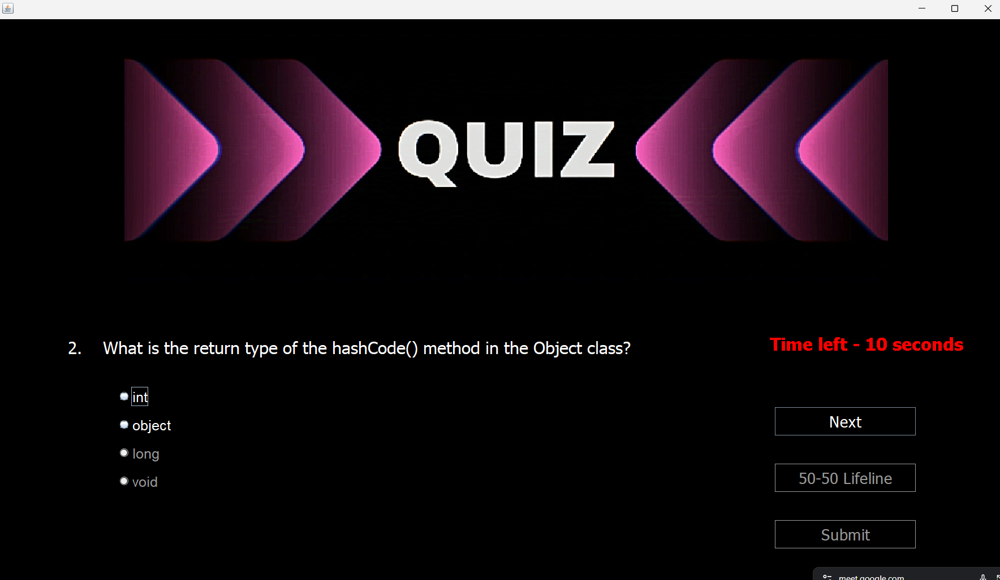
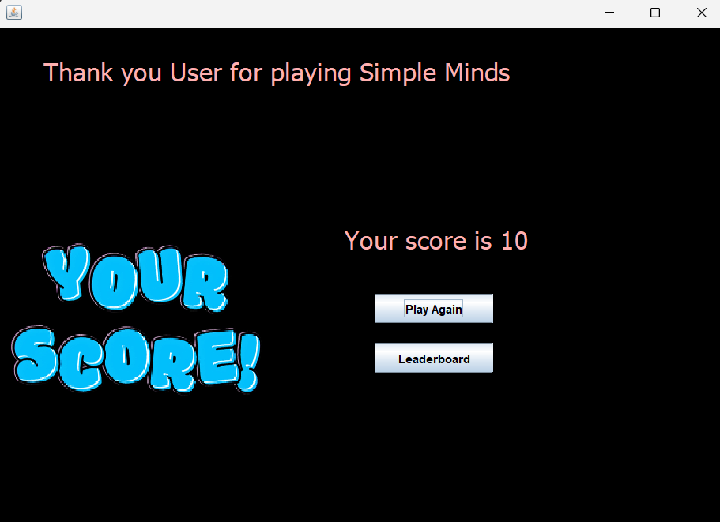

## 🎮 **Simple Minds** - Java Swing Quiz Application

Welcome to Simple Minds, a Java Swing-based desktop quiz game that challenges your programming knowledge in a fun and interactive way. This application includes time-based questions, dynamic options, and a competitive leaderboard.

# **🖼️ Overview**

Simple Minds is a GUI-based quiz platform built using Java Swing that supports:

Name entry and personalized welcome.

Randomized questions and shuffled answer choices.

Time-limited questions to add pressure.

A single-use 50-50 Lifeline that eliminates two incorrect options.

A Leaderboard that tracks users by score and completion time.

Fun and quirky rule display screen before the quiz begins.

# **⚙️ Features**
✅ Java Swing GUI: Built entirely using Java Swing for a responsive desktop interface.

🔁 Dynamic Options: Each time a question appears, its answer options are randomly shuffled—even if the same question appears again.

⏱️ Timer-Based Gameplay: Each question comes with a countdown timer to maintain challenge.

🧠 50-50 Lifeline: Can be used once per quiz to reduce answer choices to 2.

🏆 Leaderboard:

Sorted by score and time taken.

Stores user name, score, and completion time.

Includes option to clear or reset the leaderboard.
## 📸 Screenshots

### 🔹 Login Screen
 

### 🔹 Rules Display

### 🔹 Quiz in Progress
 

### 🔹 Lifeline in Action
 

### 🔹 Score Display

### 🔹 Leaderboard

